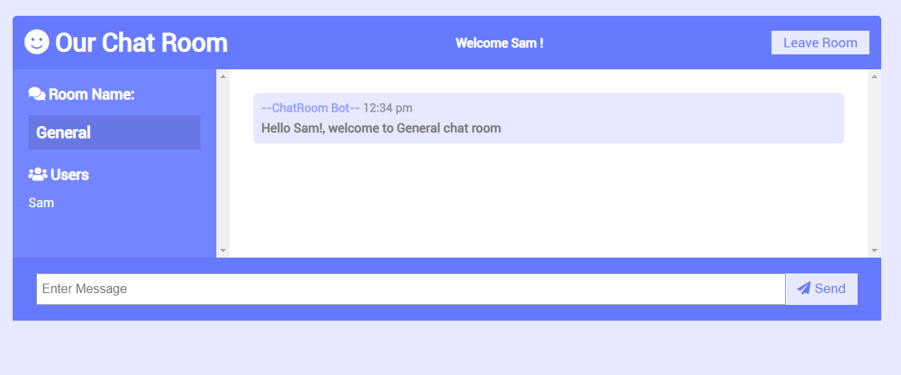

# Chat App (using Socket.io)
This app is an application which has demonstrates the use of socket.io library in npm for two-way communication.
The application has two different chat rooms where participants can join and chat. More chat rooms can be introduced by adding them into the list in index.html.

***

### Not Implemented
Following *have not* been implemented in this application:

* Database for masking the data persistent.
* Smileys and other multimedia content to be used during chat.
* File sharing during the chat.

***

### Tech Stack

* [HTML]
* [CSS]
* [VanillaJS]
* [NodeJS] +
* [ExpressJS]
* [Socket.io]

##### Additional libraries
* [moment]

***

### Running The Applications

**Please intall the above packages marked with + to ensure that you can run this project seamlessly.**

In order to run the application, follow the steps:

* Clone the project into a desired folder location or workspace.
* Run the following command to restore the packages:
    `npm install`
* If you want to debug the project use the following command:
    `npm run dev`
  otherwise, for simply running the project:
    `npm run start`
* Open the browser and visit the following url:
    `http://localhost:3000`
* Enter your name that you want to be displayed to others in the chat room.

### Results

Once you start the application, you can see something as follows:

Once you enter your name, you see the following chat screen:

You can see on the left panel, the name of the chat room and the list of participants. On the top, you can see the app name, current user and a button with title "Leave Room" which is used to exit the chat room.

When another user joins the chat, a notification is receieved by all other participant(s) in the chat room and the list of participant(s) gets updated on the left panel.

The following screen demonstrates the chat.

When a user exits the chatroom, other participant(s) will get notification.

And *Voila!*, enjoy this application and check this page regularly as new features will added to this application. :+1:

***

[//]: #
   [HTML]: <https://en.wikipedia.org/wiki/HTML>
   [CSS]: <https://en.wikipedia.org/wiki/Cascading_Style_Sheets>
   [VanillaJS]: <http://vanilla-js.com/>
   [NodeJS]: <https://nodejs.org/en/>
   [Express]: <https://expressjs.com/>
   [Socket.io]: <https://socket.io/>
   [moment]: <https://momentjs.com/>
